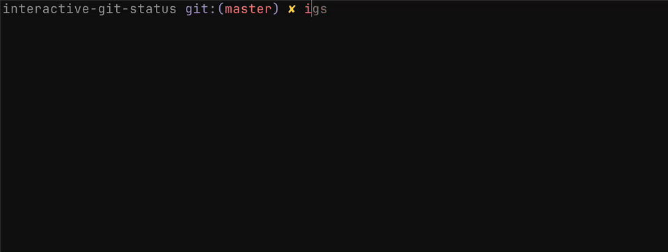

<h1 align="center">interactive-git-status</h1>

<p align="center">
  <a href="https://github.com/leohenon/interactive-git-status/releases"></a>
  <a href="https://go.dev"></a>
</p>

<p align="center">
  A minimal interactive <code>git status</code> for faster staging.
</p>

## Install

Homebrew:

```sh
brew install leohenon/tap/igs
```

Go:

```sh
go install github.com/leohenon/interactive-git-status/cmd/igs@latest
```

## Usage

```sh
igs
```


```sh
igs --short
```



## Flags

| Flag            | Description                                               |
| --------------- | --------------------------------------------------------- |
| `-s`, `--short` | Use compact interactive status view                       |
| `--ignored`     | Show ignored files                                        |
| `--show-stash`  | Show stash count. Also shown when `status.showStash=true` |
| `-h`, `--help`  | Show usage                                                |

## Keybindings

| Key                  | Action                               |
| -------------------- | ------------------------------------ |
| `j`, `↓`             | Move down                            |
| `k`, `↑`             | Move up                              |
| `ctrl-d`             | Move down half a screen              |
| `ctrl-u`             | Move up half a screen                |
| `tab`                | Jump to next section                 |
| `enter`              | Toggle selected file staged/unstaged |
| `s`                  | Stage selected file                  |
| `u`                  | Unstage selected file                |
| `a`                  | Toggle all for current side          |
| `S`                  | Stage all                            |
| `U`                  | Unstage all                          |
| `c`                  | Commit staged changes                |
| `r`                  | Refresh                              |
| `q`, `esc`, `ctrl-c` | Exit                                 |

## Why

Keep the familiar `git status` view, but stage, unstage, and commit interactively.

## What it does

- Supports staged, unstaged, untracked, ignored, and unmerged files
- Shows branch, upstream, stash, sparse checkout, detached HEAD, and in-progress operation state
- Handles renamed files, copied files, submodules, and paths with spaces

> Supports macOS and Linux.

## License

MIT
